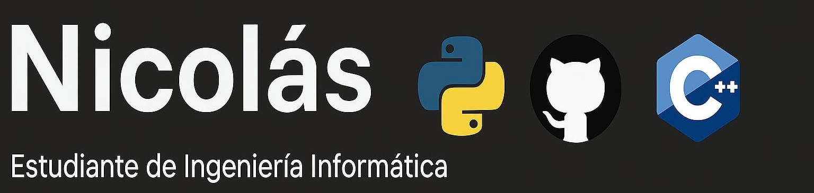

#
Soy estudiante de Ingeniería Informática con interés en el desarrollo de software y el aprendizaje constante. Actualmente tengo mayor experiencia con Python y sigo explorando otras tecnologías como C++, JavaScript, Java y Node.js. Me gusta aplicar lo que aprendo en proyectos prácticos. Siempre busco mejorar mis habilidades y adquirir nuevas herramientas que me permitan crecer como desarrollador

---

## Tecnologías que uso

- **Lenguajes**: C++, C, C#, Python, Java, JavaScript
- **Frontend**: HTML, CSS, React, Slate.js
- **Backend**: Node.js, Express, Socket.IO, Yjs
- **Bases de datos**: MongoDB, SQL Developer
- **Autenticación**: JWT
- **Deploy**: Vercel, Render
- **Control de versiones**: Git, GitHub
- **IDEs**: VSCode, Visual Studio, CLion, IntelliJ, WebStorm, PyCharm
- **Motores de juego**: Unity, Unreal Engine

---

## Proyectos destacados

- **EDI_Practica2**  
Proyecto académico que implementa estructuras de datos dinámicas para simular la gestión de servidores de videojuegos online. Se utilizan listas y colas para administrar usuarios, sesiones y partidas activas.
Tecnologías: C++
Enfoque: estructuras de datos, programación modular, lógica aplicada a entornos concurrentes.
- **PracticaIA**  
Aplicación en Python que resuelve laberintos mediante algoritmos de búsqueda (DFS y BFS). Permite visualizar el recorrido desde la entrada hasta la salida.
Tecnologías: Python
Enfoque: algoritmos de grafos, búsqueda, visualización de procesos.

- **IA_Practica**  
Implementación básica de técnicas de inteligencia artificial para resolver problemas de planeación y resolucion de laberintos. Incluye árboles de decisión y heurísticas.
Tecnologías: Python
Enfoque: fundamentos de IA, resolución de problemas, toma de decisiones automatizada.
- **IA_Practica3**
Implementación de un juego interactivo de 3 en raya (Tic-Tac-Toe) en el que el jugador humano compite contra una IA que utiliza algoritmos de decisión como Minimax y poda alfa-beta.
Tecnologías: Python
Enfoque: Diseño de árboles de decisión y algoritmos de búsqueda adversarial y comparación entre eficiencia de Minimax y poda alfa-beta.

---

## Estadísticas

---

##Contacto

-Email: nicobs3436@gmail.com

---

