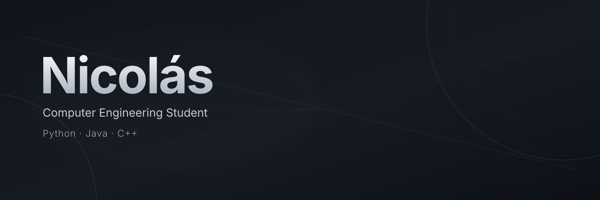

**Computer Engineering Student**

I am a Computer Engineering student focused on software development, with most of my experience in **Python, Java, and C++**.

Throughout my academic and personal projects, I have worked on backend development, mobile applications, artificial intelligence, computer vision, algorithms, data structures, databases, software architecture, and automation.

My current focus is on building increasingly complete and maintainable applications, combining solid programming fundamentals with modern technologies for backend development, mobile applications, databases, cloud services, workflow automation, testing, and deployment.

---

## Core Technologies

### Main Languages

### Application Development

### Backend & Data

### Additional Experience

### Cloud, Automation & Tools

---

## Selected Projects

### [Convivio](https://github.com/Nicobs3436/Convivio)

Android application designed to manage shared living through a structured system of users, roles, permissions, and business rules.

The application centralizes household rules, incidents and complaints, recurring tasks, weekly planning, inventories, shared expenses, reports, notifications, authentication, private storage, and administrative workflows.

The project has been tested on real Android devices and includes automated testing, type checking, database validation, role-based access control, and production-oriented Android builds.

**Stack:** React Native · Expo · TypeScript · Supabase · PostgreSQL · Google OAuth · Firebase Cloud Messaging · Vitest

---

### [Zenith](https://github.com/Nicobs3436/Zenith)

Training management platform for creating workout routines, recording sessions, analysing progression, and generating reviewable AI-assisted recommendations.

Zenith combines a Python backend with authentication, relational data persistence, database migrations, automated testing, a mobile frontend, deployment infrastructure, and CI workflows.

The AI functionality is designed as an assistance layer: recommendations and routine changes remain reviewable before being applied.

**Stack:** Python · FastAPI · SQLAlchemy · Alembic · PostgreSQL · pytest · React Native · Expo · TypeScript · Docker

---

### [Facial Recognition](https://github.com/Nicobs3436/reconocimiento_facial)

Real-time facial recognition system developed in Python.

The system detects faces using an SSD model, generates 128-dimensional facial embeddings with OpenFace, trains an SVM classifier, and performs identification using live webcam input.

**Stack:** Python · OpenCV · OpenFace · Caffe · scikit-learn · NumPy

---

### [Chess with Alpha-Beta AI](https://github.com/Nicobs3436/Ajedrez)

Chess implementation developed with custom board logic, move validation, game-state management, heuristic position evaluation, and an artificial intelligence opponent based on Minimax with alpha-beta pruning.

The project also contains unit and integration tests covering core game logic and AI behaviour.

**Stack:** Python · Minimax · Alpha-Beta Pruning · pytest

---

## Academic Work

Selected university projects covering different areas of Computer Engineering.

### [DDSI — Gym Management](https://github.com/Nicobs3436/DDSI-Gestion-Gimnasio)

Java desktop application for managing members, instructors, and activities in a gym.

The project applies persistence, relational databases, graphical interfaces, DAO-based data access, and a layered MVC-style architecture.

**Technologies:** Java · Swing · Hibernate/JPA · MariaDB · Maven

### [EDI — Game Server Manager](https://github.com/Nicobs3436/EDI_Practica2_Gestor_Servidores)

C++ project focused on the implementation of dynamic data structures in a multiplayer game-server management system.

It includes dynamic lists, circular queues, linked structures, manual memory management, and player distribution between servers.

**Technologies:** C++ · Dynamic Memory · Linked Structures · Queues

### [AI — Maze Search Algorithms](https://github.com/Nicobs3436/IA_Practica2_Busqueda_Laberintos)

Python implementation and comparison of several artificial intelligence search strategies applied to maze solving.

The project includes uninformed and informed search techniques such as BFS, DFS, iterative deepening, bidirectional search, Greedy Best-First Search, A*, and IDA*.

**Technologies:** Python · Search Algorithms · Heuristics · A* · IDA*

### [AI — Minimax & Alpha-Beta](https://github.com/Nicobs3436/IA_Practica3_TresEnRaya_Minimax_AlfaBeta)

Adversarial-search project based on Tic-Tac-Toe, developed to study and compare Minimax and alpha-beta pruning.

The implementation includes human and AI players, AI-vs-AI simulations, explored-node metrics, and execution-time comparisons.

**Technologies:** Python · Minimax · Alpha-Beta Pruning · Adversarial Search

### [Java Design Patterns](https://github.com/Nicobs3436/Patrones-de-Diseno-Java)

Repository dedicated to the practical study of software design patterns through Java implementations and examples.

It includes creational, structural, and behavioural patterns such as Factory Method, Prototype, Singleton, Adapter, Composite, Decorator, Facade, Observer, Iterator, Strategy, and Template Method.

**Technologies:** Java · Object-Oriented Programming · Design Patterns

---

## Areas of Interest

- Software architecture and maintainable application design
- Backend development and APIs
- Artificial intelligence and algorithmic problem solving
- Databases and persistence
- Mobile application development
- Cloud services and deployment
- Workflow automation and integrations
- Testing and software quality
- Computer vision

---

## Current Focus

I am currently continuing to strengthen my knowledge of **software architecture, backend development, testing, databases, cloud services, automation, and application design**, while applying these concepts to increasingly complete projects.

My goal is not only to make software work, but to understand how to design it so that it remains **clear, maintainable, testable, and extensible** as it grows.
