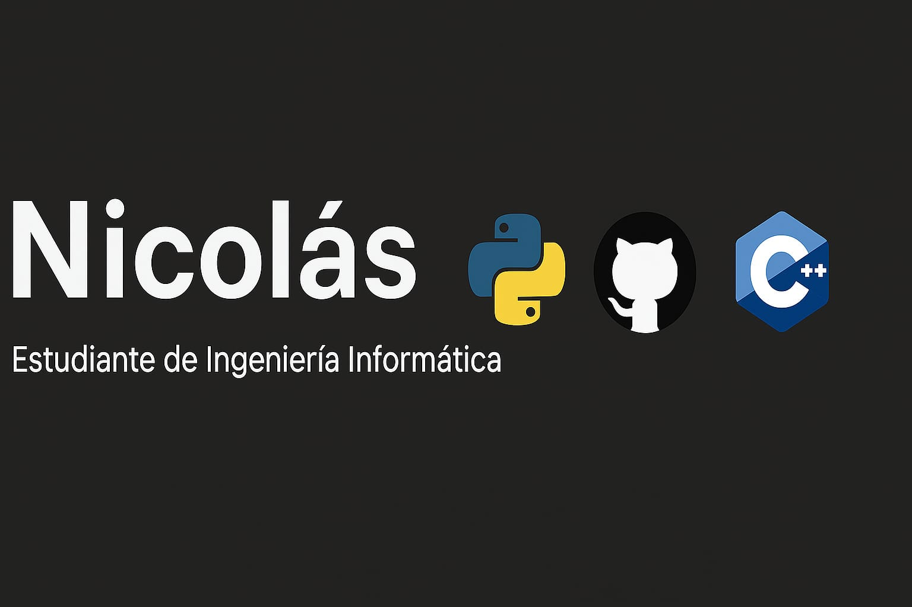

## Sobre mí
Estudiante de Ingeniería Informática con interés en el desarrollo de software y el aprendizaje constante.  
Tengo mayor experiencia con **Python**, pero también he trabajado con **C++**, **JavaScript**, **TypeScript**, **Dart**, **Java** y otros lenguajes.  
Me gusta aplicar lo que aprendo en proyectos prácticos: desde aplicaciones móviles y sistemas de visión por computador, hasta asistentes de voz y videojuegos.  

Siempre busco mejorar mis habilidades y adquirir nuevas herramientas que me permitan crecer como desarrollador.

---

## Tecnologías principales

### Lenguajes

### Desarrollo móvil

### Backend y Cloud

### IA y Visión por Computador

### Videojuegos

---

## Conocimientos adicionales

### Frameworks y librerías

### Bases de datos

### Autenticación

### Voz y automatización

### Deploy

### Control de versiones

---

## Proyectos destacados

- **Red Social de Retos Creativos** (Flutter + Firebase)  
  App móvil con publicaciones multimedia, gamificación, notificaciones y feed comunitario.

- **App Gimnasio** (React Native + Expo + TypeScript)  
  Aplicación móvil multiplataforma enfocada en la gestión de rutinas de entrenamiento.

- **Asistente de voz en Python**  
  Reconocimiento de voz, síntesis de voz, control del sistema (abrir/cerrar apps, ventanas, volumen, productividad).

- **Reconocimiento facial** (Python + OpenCV + dlib + Caffe)  
  Sistema de detección y reconocimiento de rostros en imágenes, video y cámara en tiempo real.

- **Juego de terror en desarrollo** (Unreal Engine + C++)  
  Programación de mecánicas, IA y narrativa interactiva.

- **Prácticas académicas de IA** (Python)  
  Algoritmos de búsqueda, heurísticas, Minimax con poda alfa-beta aplicados a juegos y problemas de grafos.

---

## Estadísticas

  

---
